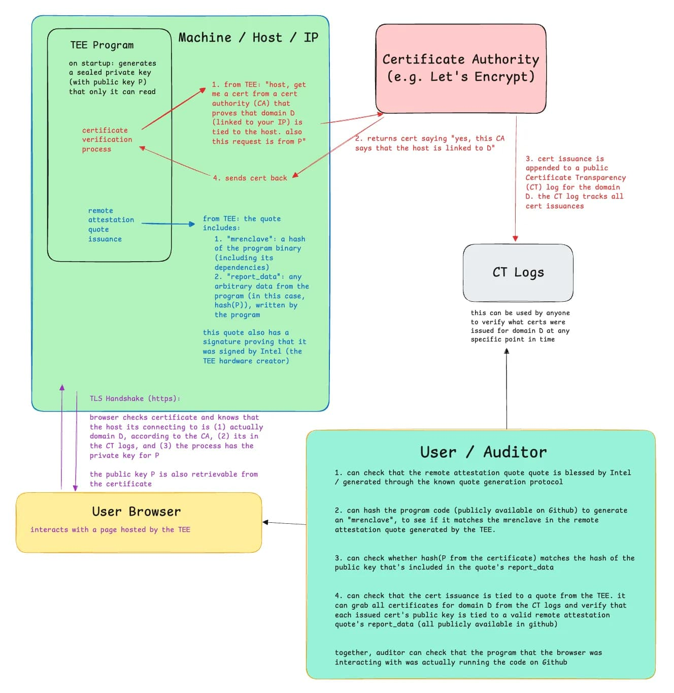

Context

Outside of MEV, TEEs unlock a new set of social experiences due to their trust guaran(tee)s.

Last Thursday (10/3/24), the Azuki team dabbled with TEEs with Flashbots in a social context on Twitter as an introduction to the community on what TEEs are and what they enable. Some background: [Bobu](https://x.com/BobuBeanFarmer) is a fractionalized Azuki NFT who is beloved by the Azuki audience. The stunt involved letting a well-known community member tweet through Bobu’s twitter account. TEEs were central to this experience for guaranteeing through auditability that the community member could only tweet from Bobu’s account under a restricted set of conditions (one time max), even if the underlying OAuth scope granted did not have any such restriction. Below I will break down how the security for this flow works.

Security

The core assumption being maintained is that if a one-time use token to tweet on behalf of an X account is created, the owner of that X account (1) explicitly saw an authorization window that described how the token would be used, and (2) approved it.

To accomplish this, we must ensure that the X access token (1) can only be accessed by a restricted set of executors, and (2) that the executors do exactly what we expect. This is where TEEs come in.

For (1): the OAuth flow for the X access token goes directly to a TEE through callback url. This ensures reasonably that only the TEE has access to the token.
For (2): a TEE emits “remote attestation quotes” that are signed by Intel and include hashes of the program binary (and its dependencies).
Auditors can use this hashed value at any point to validate that these hashes matches the hashes from expected code (which is available publicly on Github).
The emitted quotes also include a hashed public key of a private key that only the TEE has access to. The user can validate that the certificate of the domain their browser is connecting to is linked to a public key that matches that of the TEE keypair.
See diagram below for more detail:

A more detailed writeup of the thread model can be found [here](https://github.com/Account-Link/teleport-gramine-rs/blob/main/AUDITING.md) (the same principles as the Teleport experiment are being used).

Looking Forward
The experiment was a success, as it resulted in more education around TEEs to an audience that was previously unfamiliar to it. Some Azuki community members were writing threads educating others on what TEEs were, while others were brainstorming and tweeting out other creative ways this tech could be applied to social. This was the first in a series of experiments: the next one will happen on a larger scale, and many users are already opting in a future magic show via a [Bobu invite](https://bobu.azuki.com/magicshow) that walks the user through a TEE authorization flow.

